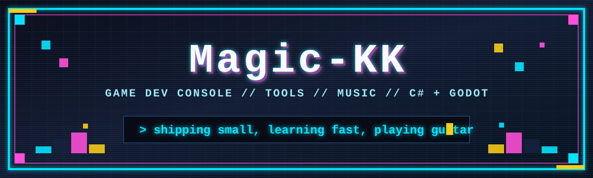
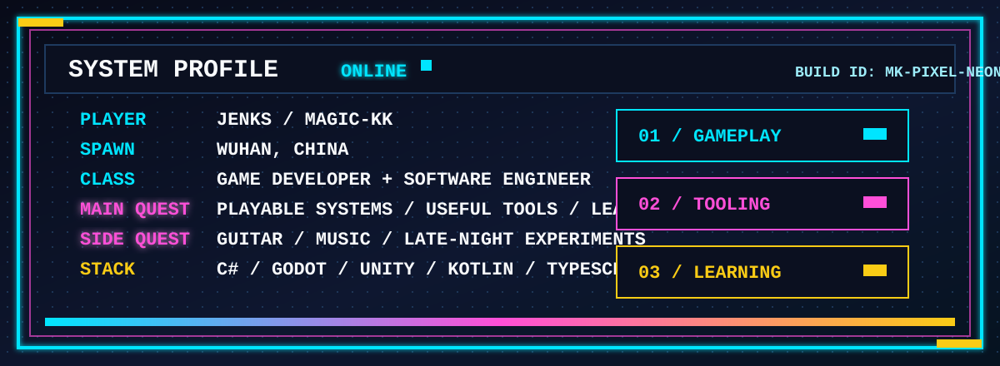

<!-- Magic-KK profile README -->

<div align="center">



<br/>

[](https://github.com/Magic-KK)
[](https://github.com/Magic-KK?tab=followers)
[](https://github.com/Magic-KK?tab=repositories)
[](mailto:jenkskk@gmail.com)

</div>

---

## SYSTEM PROFILE

<div align="center">



</div>

---

## ACTIVE QUESTS

```diff
+ Create Godot 4 C# learning material that is easy to follow
+ Build cleaner game/editor workflows with Unity and Godot
+ Explore EasyArm and ARM-related development
+ Keep turning rough ideas into shipped repos
```

<div align="center">

| Focus | Status | Energy |
| :-- | :-- | :-- |
| Game development | `active` | █████████░ |
| Godot / C# | `active` | ████████░░ |
| Tool building | `active` | ████████░░ |
| Music creation | `side quest` | ██████░░░░ |

</div>

---

## LOADOUT

<div align="center">

### Core Languages


### Engines & UI


### Workflow


</div>

---

## PROJECT MAP

<div align="center">

<a href="https://github.com/Magic-KK/godot4-csharp-learning">
  
</a>
<a href="https://github.com/Magic-KK/EasyArm">
  
</a>

<a href="https://github.com/Magic-KK/node-monitor">
  
</a>
<a href="https://github.com/Magic-KK/EasyArm-NetWork">
  
</a>

<a href="https://github.com/Magic-KK/countdownview">
  
</a>
<a href="https://github.com/Magic-KK/Magic-KK">
  
</a>

</div>

---

## TELEMETRY

<div align="center">


</div>

---

## ACHIEVEMENTS

<div align="center">


[](https://github.com/Magic-KK)

</div>

---

<div align="center">

```text
save point reached
coffee: ready    guitar: tuned    editor: open
```

[](https://github.com/Magic-KK)
[](mailto:jenkskk@gmail.com)

</div>
